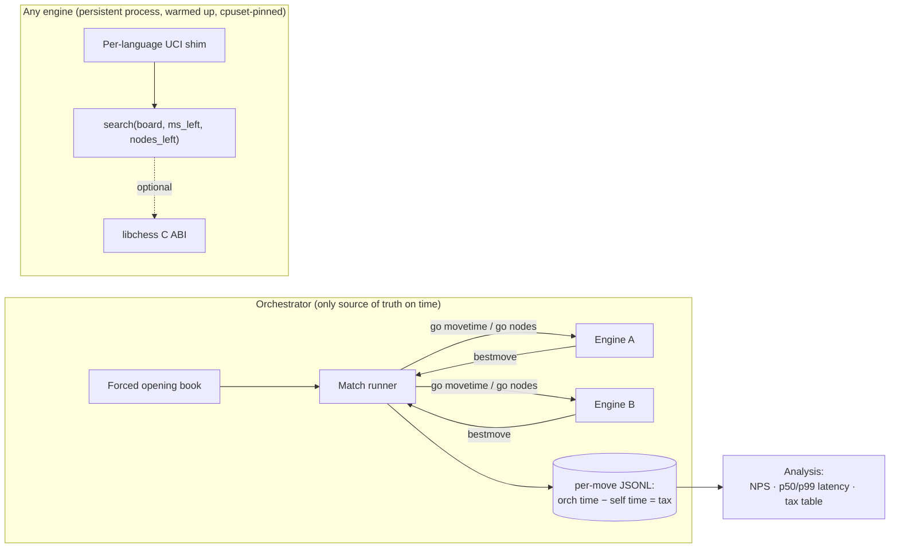

# Chess World Cup

A 48-engine chess tournament in World Cup format, where **every engine is written in a
different language/paradigm** and plays under tight per-move time budgets.

The tournament is the surface. The real research question is:

> **Decompose engine strength into *knowledge* (Elo per node) and *speed* (nodes per
> second), and measure the *language tax*** — the Elo an engine loses purely to its
> implementation, isolated by running the same field under fixed-node and wall-clock
> conditions.

Every design decision serves that measurement.

---

## The measurement

Two engines can have identical chess *knowledge* and still finish leagues apart, purely
because one is written in C++ and the other in Python. We isolate that gap by running the
same field twice:

```
                knowledge (Elo / node)
                        ▲
        py-mcts  ◄──────┼─────────────────  the "knowledge pole"
                        │        ·
                        │            ·
                        │                ·   language tax
                        │                    ·   (horizontal gap between
                        │                        · fixed-node and wall-clock)
                        │                            ·
      cpp-alphabeta ────┼──────────────────────────────►  random
                        │                     speed (nodes / sec)
                        └───────────────────────────────────►
```

- **Fixed-node mode** (`--nodes`) gives every engine the same *thinking budget*. Bit-
  reproducible given `(engine, position, node budget, seed)`. Isolates **knowledge**.
- **Wall-clock mode** (`--movetime`) gives every engine the same *wall-clock budget*.
  A slow language burns its budget on interpreter/GC overhead. Isolates **speed**.

The **language tax** is the Elo difference between an engine's fixed-node rank and its
wall-clock rank.

---

## Architecture



Every engine speaks **UCI over stdin/stdout**. The handshake is extended with metadata
only (`id lang`, `id family`, `id country`). Engines are **persistent processes** for the
whole match and get a **discarded warm-up** before the clock starts, so we measure chess —
not JIT compilation.

---

## Status — Phase 0

Phase 0 goal: three wildly different engines (`cpp-alphabeta`, `py-mcts`, `random`) play a
clean 100-game match with honest latency logs and no JIT contamination.

| Gate | What it proves | Status |
|---|---|---|
| **1 — perft** | movegen is exact to the node | ✅ **green** |
| **2 — protocol conformance** | `random` survives 100 self-games, zero errors | ✅ **green** |
| **3 — warm-up isolation** | NPS curve flat over moves 1–20 | ✅ **green** (C++; revisit w/ py-mcts) |
| **4 — timing honesty** | orchestrator−self delta small & stable | ✅ **green** |
| 5 — the experiment in miniature | rank flips between fixed-node and wall-clock | ⬜ not started |

### Gate 1 results (`libchess`)

`libchess` is a C++20 bitboard core with **runtime-generated magic bitboards** for sliding
pieces and fully legal movegen (castling, en passant, promotions, pin/check handling via
make/unmake king-safety filtering).

```
startpos   rnbqkbnr/pppppppp/8/8/8/8/PPPPPPPP/RNBQKBNR w KQkq - 0 1
  depth 1               20  ✓        depth 4          197,281  ✓
  depth 2              400  ✓        depth 5        4,865,609  ✓
  depth 3            8,902  ✓        depth 6      119,060,324  ✓

kiwipete   r3k2r/p1ppqpb1/bn2pnp1/3PN3/1p2P3/2N2Q1p/PPPBBPPP/R3K2R w KQkq - 0 1
  depth 1               48  ✓        depth 4        4,085,603  ✓
  depth 2            2,039  ✓        depth 5      193,690,690  ✓
  depth 3           97,862  ✓

position3  8/2p5/3p4/KP5r/1R3p1k/8/4P1P1/8 w - - 0 1
  depth 1               14  ✓        depth 4           43,238  ✓
  depth 2              191  ✓        depth 5          674,624  ✓
  depth 3            2,812  ✓        depth 6       11,030,083  ✓
```

**perft(5) startpos: ~82 Mnodes/s** (Apple clang `-O3`, single core). This is a
legality-filtered make/unmake perft, not a bulk-counting perft — it exercises the exact
make/unmake path a search will use.

### Gate 2 results (protocol conformance)

`random` (uniform random legal move) played **100 games against itself** through the full
harness — persistent processes, warm-up, UCI over pipes, orchestrator as referee:

```
games completed : 100 / 100
protocol errors : 0
timeouts        : 0
illegal moves   : 0
GATE 2: PASS
```

The orchestrator is the referee (validates every move against `libchess`, adjudicates
mate/stalemate/50-move/repetition/insufficient-material) and the timekeeper (monotonic
`go → bestmove`). It writes a per-move JSONL log whose key column is the implementation
tax, `delta_ms = orch_ms − self_ms`. With identical seeds, move sequences are
**bit-reproducible** across runs (only timing varies).

```bash
# random vs random, 100 games, 20ms/move
./build/orchestrator --engine1 ./build/random --engine2 ./build/random \
    --games 100 --movetime 20 --log match.jsonl
# fixed-node mode instead:
./build/orchestrator ... --nodes 100000
```

### Gate 3 + 4 results (`cpp-alphabeta` + analysis)

`cpp-alphabeta` is the **speed pole**: iterative-deepening alpha-beta + quiescence with a
handcrafted integer eval (material + piece-square tables, no floats). It beats `random`
**10–0** and, in fixed-node mode, produces **bit-identical move sequences across full
match runs** — satisfying the determinism non-negotiable.

`analysis/report.py` reads the match JSONL and emits the Phase-0 measurement outputs.
From 20 self-play games at 20 ms/move (1,632 moves):

**Gate 3 — warm-up isolation** (mean NPS by move number; the curve must be flat):

```
cpp-alphabeta   (moves 1-20, spread 27% of mean — NO move-1 cold-start spike)
  move  1   0.85 Mnps   ###########################
  move  2   0.85 Mnps   ###########################
  move 10   0.80 Mnps   ##########################
  move 20   0.96 Mnps   ###############################   (endgame: fewer pieces)
```

Move 1 is *not* slower than move 10 — the warm-up removed cold-start contamination. The
gentle upward drift late is endgame node speed-up, not a JIT artifact. This gate becomes
dramatic once `py-mcts` (a JIT/GC language) joins; C++ passing it is the sanity baseline.

**Gate 4 — timing honesty** (`delta_ms = orch_ms − self_ms` = IPC + GC + scheduling tax):

```
engine            moves    p50    p90    p99  |  delta p50  delta p99  delta max
cpp-alphabeta      1632     15     17     18  |          0          1          1
```

The implementation tax is **≤ 1 ms** and stable — single-digit ms as required, so the
wall-clock event is trustworthy. (`random` searches sub-millisecond, so its NPS is not
measurable — expected for the anchor.)

```bash
python3 analysis/report.py match.jsonl
```

---

## Build & run

```bash
cmake -B build -S . -DCMAKE_BUILD_TYPE=Release
cmake --build build -j
ctest --test-dir build --output-on-failure   # runs the perft gate
./build/perft                                 # full table + NPS
```

Requires a C++20 compiler and CMake ≥ 3.16.

---

## Repo layout

```
/libchess          C++ bitboard core + UCI move helpers   (Gate 1 ✅)
/shim/cpp          UCI shim, C++                           (built ✅)
/shim/py           UCI shim, Python                        (not started)
/bots/cpp-alphabeta  classical alpha-beta — the speed pole (built ✅)
/bots/py-mcts        Python MCTS — the knowledge pole      (not started)
/bots/random         uniform random — Elo anchor & canary  (built ✅)
/orchestrator      match runner, timing, logging, referee  (built ✅)
/analysis          NPS curve, latency + delta tables (report.py ✅)
/books             forced opening book (UCI move lists)    (openings.txt ✅)
/tests             perft suite (perft.cpp)                 (Gate 1 ✅)
/docker            one Dockerfile per bot + base images    (not started)
```

---

## Non-negotiables

These invalidate the results if violated:

1. UCI over stdin/stdout is the protocol — no invented wire format.
2. Engines are persistent processes for the whole match — never spawn per-move.
3. Every engine gets a discarded warm-up before the clock starts.
4. The orchestrator is the only source of truth on time; the `orchestrator − self-reported`
   delta is the implementation tax, logged on every move.
5. One game at a time, pinned core, turbo off, memory capped.
6. Determinism where we can get it — fixed-node mode is bit-reproducible.
7. Perft-clean before anything else.
8. No UI in Phase 0.

See [`CLAUDE.md`](CLAUDE.md) for the full spec and verification gates.
